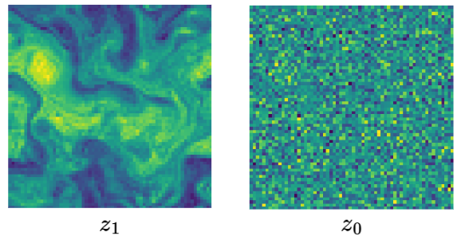

# Noise Latent Space

This repository contains the code for a research project on forecasting in noise latent spaces for course 732A76.

Example code for inversion and sampling can be found in `playground.ipynb`.

To generate additional training data, run `sqg_nature_run.py` first and then `generate_inverted_timeseries.py`.

To run the sampling and forecasting code, you need:
- `pytorch`
- `numpy`
- `matplotlib`

To generate new SQG data, you also need:
- `pyfftw`
- `netcdf4`

# Where Does the Noise Latent Space Come From?

## Preliminaries

## What Is the Model Trained To Learn?

The model takes as input
\[
z_t = (1 - t) z_0 + t z_1,
\]
which is an interpolated intermediate state between the noise sample $z_0$ and the data sample $z_1$.

The training target is
\[
\frac{d z_t}{d t},
\]
which, under this linear interpolation, is simply
\[
z_1 - z_0.
\]

Therefore, the model learns a time-dependent velocity field along the interpolation path.

## ODE Induced by the Model Output

In `sampler.py`, the `invert()` function maps a physical field back into latent space. Under the deterministic setting used for inversion, the process can be viewed as an ODE of the form
\[
dz = b \, dt.
\]
The latent representation of each physical frame is obtained by iterating
\[
z_t = z_{t-1} + dz
\]
over many small steps.

# Theoretical Analysis

The model is trained to fit the velocity field along the interpolation path, not the true physical time evolution itself. This interpolation connects the data distribution to Gaussian noise, $N(0, I)$. As inversion proceeds, the latent representation is therefore pushed toward the Gaussian prior.

In theory, if the model is accurate enough and the numerical integration is sufficiently fine, the inverted latent variables should become increasingly close to samples from $N(0, I)$.

# Why the Latent Space May Still Be Useful for Forecasting

Although the inversion is designed to push samples toward a Gaussian prior, this does not mean that the latent space is trivially "just noise." Different physical samples can still be mapped to different locations within the shared $N(0, I)$ latent space, so the latent coordinates may retain meaningful structure inherited from the original dynamics.

Forecasting in latent space may still be advantageous if:
1. the temporal evolution in latent space is simpler than in physical space,
2. the transition $z_t \rightarrow z_{t+1}$ is more linear, or
3. the uncertainty is easier to model there.

In that sense, matching a Gaussian prior does not remove the potential forecasting value of the latent representation; it only defines the global distribution that the inverted samples are encouraged to follow.

# What Does Time-Aligned Interpolation Actually Do?

The main analysis in this project focuses on time-aligned interpolation. More specifically, interpolation is performed between $z_t$ and $z_{t+\delta t}$ in latent space, and the interpolated latent states are then mapped back deterministically to the physical field. These reconstructed fields are then compared with the true physical frames.

In the following, I refer to "time-aligned interpolation" simply as "interpolation." In this project, interpolation is used as a practical diagnostic rather than a definitive test of whether predictable dynamics are preserved in latent space. My original motivation was that if linear or stochastic interpolation could reconstruct intermediate frames with high geometric similarity to the true ones, then the latent representation might still retain some meaningful dynamical structure.

However, the trajectory produced by interpolation is imposed by the interpolation rule itself, whereas the true latent trajectory between two observed states is unknown. For that reason, good interpolation results can indicate geometric consistency or local smoothness, but they do not by themselves prove that the true predictive dynamics have been preserved, simplified, or made easier to forecast in latent space.

# If Interpolation Cannot Establish This, What Is the Next Step?

The next experiment is to test the forecasting problem more directly: train the same model on the latent-space dataset and on the physical-space dataset, and then compare their performance.

To make this comparison meaningful, the model should be suitable for both datasets. In this project, ConvLSTM is used as the benchmark model. Compared with a standard LSTM, ConvLSTM replaces fully connected operations with convolutions, which allows it to preserve spatial information and makes it more appropriate for field data.

ConvLSTM is used here for several reasons:
1. it is designed for spatiotemporal modeling and has been shown to work well on radar-like or fluid-like data,
2. it does not require a separate statistical model of spatiotemporal correlation before training, which keeps the benchmark simple,
3. it accepts image-like inputs directly, which is important because the latent states here cannot be compressed into a useful 1D representation, and PCA was not effective,
4. it is relatively lightweight compared with larger alternatives such as PhyDNet, Stochastic Latent Residual Video Prediction, PredRNN, and Earthformer.

# Experiments and Results

A two-layer ConvLSTM model was trained on both datasets. In practice, forecasting in physical space performed much better than forecasting in latent space. In addition, the latent-space training stopped early at epoch 93 out of 100, whereas this did not happen for the physical-space model.

After training, the predicted latent state was mapped back to physical space and compared with the true physical field. For the model trained directly on physical space, the prediction was compared with the true data directly. The corresponding results can be found in `trainConvLSTM.ipynb` and `trainConvLSTM_onTrue.ipynb`.

At least for this benchmark, the latent-space approach did not improve forecasting. It is also worth noting that the mapping between latent space and physical space is deterministic in this setup. If the true latent state is mapped back to physical space, the RMSE should be zero. In other words, the projection itself does not introduce additional error.

The main conclusion from this experiment is that compressing the distribution is not the same as simplifying the dynamics. One possible interpretation is that the diffusion model compresses the distribution while also removing part of the dynamical structure. This remains a hypothesis rather than a demonstrated result, but it is the main takeaway from the current benchmark.
