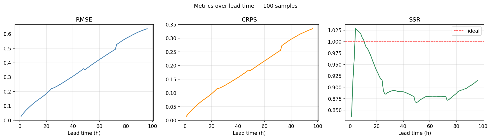

# Analysis

Since I’ve implemented the conditional model and forecasting algorithm, I’d like to share the forecasting performance at first:

There are also some visual example

## Investigation Plan and Analysis

Following the investigation plan there are 3 questions that:

1. Is the forecasting trajectory really physical meaningful?
2. What kind of dynamics of inverted trajectory imply?
3. Can we conduct a method to learn the dynamics?

**Personally I’d like to prioritize the last 2 questions. Since there are 2 properties in our pre-trained model:** 

1. In the model training, the stochastic interpolants was defined between sample from normal distribution and sample from the distribution from the physical data, that says the latent space noise from the pre-trained model has to preserve the normal distribution as well (marginally).
2. Since the velocity is the function in ODE, which means this process is totally reversible and deterministic.

Adding them up we can know that, if the latent space noise fails to preserve the marginal distribution as normal distribution, the physical meaning of sampled or forecasting physical data would also lose some physical meaning.

Thus, among three questions, the last two is more urgent and the answer for the first one could be supplementary.

**There is another important clue or material about learning noise process**, where has inferred the function presenting dynamics:

$Cov(\epsilon^{(i)}_t, \epsilon^{(i)}_0) = \alpha_i(t; x_0)$

which is a function of $t$ and $x_0$

and also has inferred the estimator that: 

$E[\epsilon_t | \epsilon_0] = α(t; x_0)\epsilon_0.$ 

$L(φ) = E_{(\epsilon_0, \epsilon_1)}[   ∥\epsilon_t− α_φ(t; x_0)\epsilon_0∥^2]$  

on the basis of the assumption (latent space noise preserves the marginal distribution of the trajectory as normal distribution, which says each coordinate in $\epsilon_t$ evolves independently).

Therefore, to follow the inference of the given material to investigate the dynamics, we need to not only analyze the dynamics (examine the dependence of the function), but perform distribution check to ensure the assumption stands true.

## The analysis

**Inverted latent space data preprocessing and why in this way:** I pooling over all the trajectories and preserved lead time, since lead time $t$ is input as well, so different $t$ means different mapping, so the inverted latent space noise in different lead time may follows different distributions.

**Experiment 1 — marginal check.** Per lead $t$, test $\epsilon_t \sim \mathcal N(0,I)$: moments/kurtosis, and spatial power spectrum flatness (white noise ⟹ flat spectrum). The moments examination is about the marginal distribution test of the distribution of $\epsilon_t$. The second one is more important to examine the assumption in Learning Stochastic Process (every coordinates evolve independently).

**Result:** $\epsilon_t \sim \mathcal N(0,\Sigma)$, but good news: for each $\epsilon_t$, it is spatially stationary visually. That says the modeling in Learning Stochastic Process is not directly available, but we still can use its logic. 

**Experiment 2 — empirical temporal correlation function.** $\hat\rho(t,t') = \frac{1}{d}\mathbb{E}[\langle \epsilon_t, \epsilon_{t'}\rangle]$ with $d = 2{\cdot}64{\cdot}64 = 8192$. 

 (NOTE THAT the empirical temporal correlation was computed following the assumption that latent space noise follows $N(0,I)$, that’s why I’ve got the pattern but I can’t directly fit)

I am going to investigate the temporal correlation in these few perspectives: 

**(a) Stationarity:** does $\hat\rho$ depend only on $|t-t'|$?  It answers if we want to learn the temporal correlation, a function to describe the correlation over all lead time is enough.

**(b) Exponential decay:**  Since we used OU process as input of forecasting to inject autocorrelation of the trajectory, naturally OU process would be the candidate when we try to recognize the temporal correlation. To compare the empirical temporal correlation and that from OU process we can use the property of OU to design the experime:

OU predicts $\rho(\Delta) = e^{-\rho\Delta}$, i.e., $\log\hat\rho$ linear in Δ — a one-plot test. If linear → the OU family is adequate. If decay is non-exponential or non-stationary, a smoother kernel is required. I plotted it using semi-log plot, so if $\hat\rho$ would be linear if it is exponentially linear.

Cov(ϵt(i),ϵ0(i))=αi(t;x0)

Cov(ϵt(i),ϵ0(i))=αi(t;x0)

**(c) $x_0$-dependence:** bin $\hat\rho$ by properties of the anchor (enstrophy: it converts 2D $x_0$ into a scalar so we can plot temporal correlation dependence on $x_0$), check visually and compute the correlation of $\hat\rho$ at the certain lead time over enstrophy bins. Since Learning Stochastic Process assumes that the temporal correlation is a function of $t$ and $x_0$, let’s see whether it’s true or not.

**Result:** 

**Good news:** The temporal correlation is stationary and independent on $x_0$. that says we can only define our estimator as $\alpha(t)$. 

**Bad news:** $\hat\rho$ shows that it decays neither exponentially linear nor squared exponentially linear, that says we need a neural network to fit it.

## Problem

In Learning Stochastic Process, it assumes that $\epsilon_t \sim \mathcal N(0,I)$, and infers the estimator we need, but in practice, spatial correlation exists. The next question would be in our latent space noise, what kind of effect would spatial correlation cause on the estimator, or specifically does the actually marginal distribution of $\epsilon_t$ break the estimator of $\alpha(t)$ in §3.6 (Learning Stochastic Process)?

There would be two conditions, but firstly I’d like to clarify the notations.

Note that: 

$\epsilon_t\in\mathbb{R}^d$  and  $\epsilon_t \sim \mathcal N(0,\Sigma)$, where $t = 1, 2, 3, ... 24$.

Spatial covariance and cross-channel covariance: $\;\Sigma$.

Temporal cross-covariance: $\;C(t)$.

**Condition 1:** 

 The space–time structure is *separable* if the temporal and spatial factors decouple:

$C(t)=\alpha(t)\,\Sigma \quad\text{for a scalar function }\alpha(t) .$

**Condition 2:**

It is *non-separable,* a single $\alpha(t)$ is inadequate, we need spatially weighted $\alpha(t)$.

## Further Investigation Plan

1. Examine whether the spatial correlation is stationary or not (the present evidence is from visual observation).
2. Examine whether the space—time structure is separable or not. 
3. If not(probably not), since $\Sigma$ is symmetric positive-semidefinite, we can perform an orthonormal eigendecomposition on  $\epsilon_t$, on 2D-Fourier basis (cheaper and more accessible method). Infer the estimator with spatial weights.
4. Justify the estimator and perform estimation.

⁍